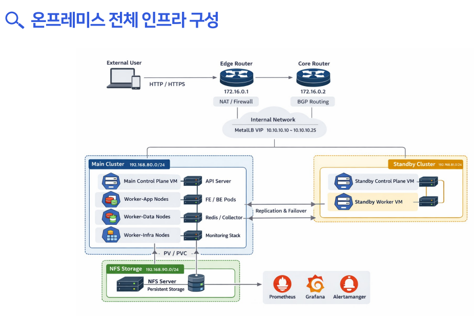
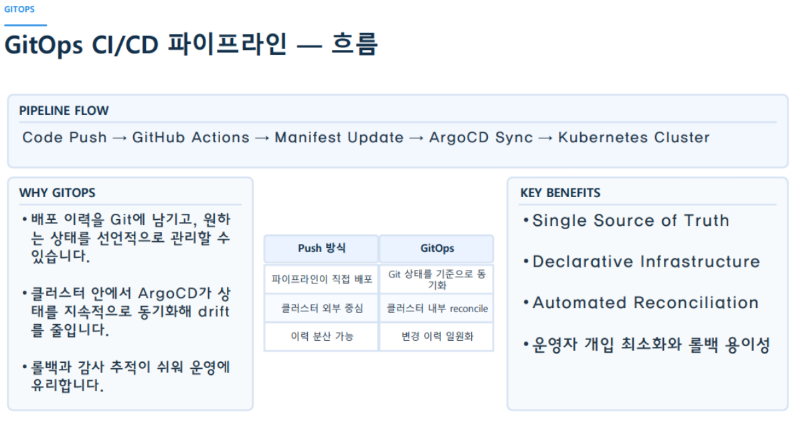
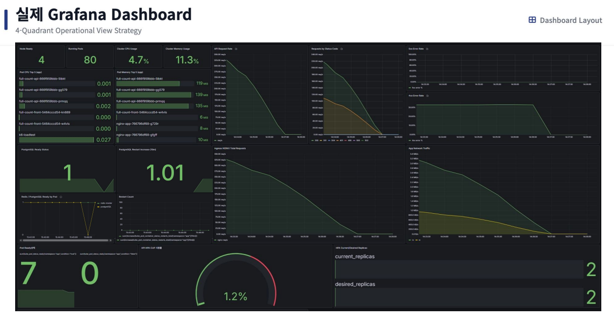

# ⚾ Full Count — Kubernetes Manifest Repository

> **온프레미스 Kubernetes 기반 MLB 실시간 문자 중계 및 응원 플랫폼**  
> GitOps(ArgoCD) 방식으로 운영되는 쿠버네티스 매니페스트 아카이브입니다.

[](https://kubernetes.io/)
[](https://argo-cd.readthedocs.io/)
[](https://github.com/features/actions)
[](https://prometheus.io/)
[](https://grafana.com/)

---

## 📌 프로젝트 개요

**Full Count**는 MLB 실시간 경기 데이터를 제공하고 사용자 간 채팅·응원 기능을 제공하는 웹 플랫폼입니다.  
클라우드가 아닌 **온프레미스 환경**에서 Kubernetes를 직접 구축하여, 실제 운영에 가까운 인프라 경험을 목표로 했습니다.

| 항목 | 내용 |
|------|------|
| **기간** | 2026.02 ~ 2026.03 |
| **팀 구성** | 4인 (플랫폼/백엔드, 네트워크/보안, 데이터/스토리지, Observability/SRE) |
| **인프라 환경** | 온프레미스 VM 기반 Kubernetes (kubeadm) |
| **배포 방식** | GitOps — GitHub Actions + ArgoCD |
| **관련 레포** | [백엔드](https://github.com/full-count-OnPre/full-count-back) · [프론트엔드](https://github.com/full-count-OnPre/full-count-front) |

---

## 🏗 전체 시스템 아키텍처



```
External User
     │  HTTP/HTTPS
     ▼
Edge Router (NAT/ACL, 172.16.0.1)
     │
     ▼
Core Router (eBGP, AS65001, 172.16.0.2)
     │
     ▼
MetalLB VIP (10.10.10.10 ~ 10.10.10.25)
     │
     ▼
NGINX Ingress Controller
     ├── /api  → full-count-api (Express.js / Node.js)
     └── /     → full-count-front (React + Vite)

[ Main Cluster 192.168.80.0/24 ]       [ Standby Cluster 192.168.81.0/24 ]
  Main Control Plane VM                  Standby Control Plane VM
  Worker-App Node (FE/BE Pods)      ←→  Standby Worker VM (Failover)
  Worker-Data Node (Redis/Collector)
  Worker-Infra Node (Monitoring Stack)
        │ PV/PVC
        ▼
[ NFS Storage 192.168.90.0/24 ]
  NFS Server — PostgreSQL PVC / Backup PVC
        │
        ▼
  Prometheus · Grafana · Alertmanager
```

---

## 📁 디렉터리 구조

```
full-count-k8s/
├── ljm/                    # 🔵 Kubernetes 플랫폼 / 백엔드 (이재민)
├── ksw/                    # 🟢 네트워크 / 보안 인프라 (김승완)
├── ktk/data-platform/      # 🟡 데이터 플랫폼 / 스토리지 (김태경)
└── sds/sre-monitoring/     # 🔴 Observability / SRE (심동섭)
```

각 디렉터리의 상세 내용은 해당 폴더의 README를 참고하세요.

---

## 🛠 전체 기술 스택

| 분류 | 기술 |
|------|------|
| **Container Orchestration** | Kubernetes v1.34 (kubeadm) |
| **GitOps / CD** | ArgoCD |
| **CI** | GitHub Actions |
| **Ingress / LB** | NGINX Ingress Controller, MetalLB (BGP) |
| **Storage** | NFS (nfs-subdir-external-provisioner) |
| **Monitoring** | Prometheus, Grafana, Loki, Alertmanager |
| **Backend** | Express.js, Prisma, PostgreSQL, Redis |
| **Frontend** | React, Vite |
| **Network** | GNS3, Edge/Core Router, BGP, NAT/ACL, Tailscale |

---

## 🚀 GitOps 배포 흐름



```
Code Push → GitHub Actions → Manifest Update → ArgoCD Sync → Kubernetes Cluster
```

1. `main` 브랜치에 코드 Push
2. GitHub Actions가 Docker 이미지 빌드 후 레지스트리 Push
3. `full-count-k8s` 레포의 Manifest 이미지 태그 자동 업데이트
4. ArgoCD가 변경을 감지하여 클러스터에 자동 배포

---

## 📊 운영 모니터링



Prometheus + Grafana 기반 4-Quadrant 운영 대시보드로 인프라, 애플리케이션, 서비스, 확장성 지표를 실시간 모니터링합니다.

---

## 👥 팀 역할 분담

| 이름 | 역할 | 담당 폴더 | 상세 |
|------|------|-----------|------|
| **이재민** | Kubernetes 플랫폼 / 백엔드 | [`ljm/`](./ljm) | [README](./ljm/README.md) |
| **김승완** | 네트워크 / 보안 인프라 | [`ksw/`](./ksw) | — |
| **김태경** | 데이터 플랫폼 / 스토리지 | [`ktk/`](./ktk) | — |
| **심동섭** | Observability / SRE | [`sds/`](./sds) | — |
